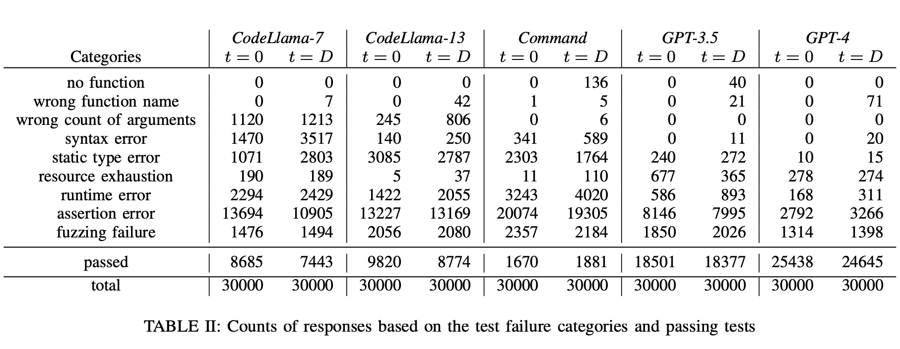
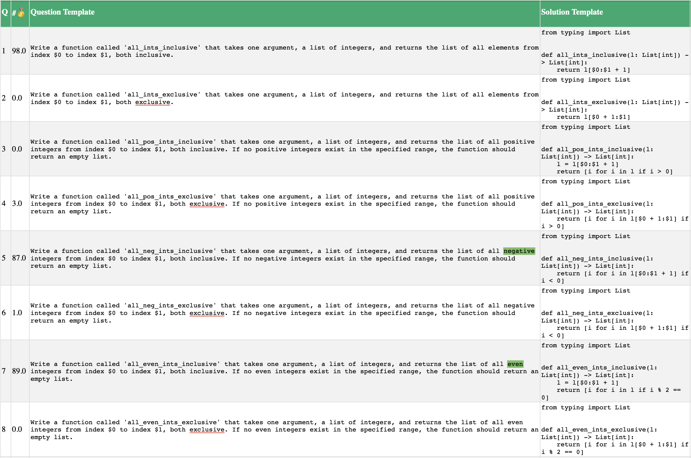
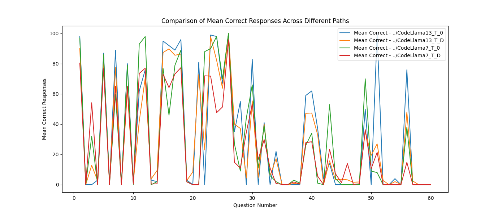

# A Problem of CodeLlama

[This paper](https://arxiv.org/abs/2312.14856) designs a new test dataset for code models and makes the test results on models such as GPT-4, GPT-3.5, CodeLlama (7B and 13B, 4-bit quantization) [open-source](https://github.com/ShahinHonarvar/Turbulence-Benchmark). 

Some noteworthy data analyses in the paper show, for example, the differences between setting the temperature to 0 or the default value D in Table II indicate that **when generating code with LLMs, basically using temperature=0 is sufficient**.


As shown in the figure below, the dataset consists of 60 manually designed question templates (the image shows the first 8 of them). Each question template has several variable parameters ($0, $1, etc.), and by replacing these parameters with specific values, a set of similar question instances can be formed. The paper generated 100 variants for each template, resulting in 6000 question instances in total. Each model was tested with each question instance 5 times, generating 30000 Python functions. These functions were then tested with test cases also designed manually using templates.

Figure 1: Mean correct on CodeLlama 13B t=0

The above figure shows the average number of correct code generated out of 100 variants of each question template on CodeLlama 13B, shown in the second column. Complete statistics for other CodeLlama models and temperature settings are in my fork repository: [13B t=0](https://github.com/AI-LLM/Turbulence-Benchmark/blob/main/CodeLlama13_T_0/all-templates.html), [13B t=D](https://github.com/AI-LLM/Turbulence-Benchmark/blob/main/CodeLlama13_T_D/all-templates.html), [7B t=0](https://github.com/AI-LLM/Turbulence-Benchmark/blob/main/CodeLlama7_T_0/all-templates.html), [7B t=D](https://github.com/AI-LLM/Turbulence-Benchmark/blob/main/CodeLlama7_T_D/all-templates.html).

Each question template essentially determines the difficulty of the question, and 100 variant instances can be seen as minor perturbations to test the robustness of LLMs. The difficulty of the questions generally increases with the sequence number, such as Q3 and Q4 are more challenging than Q1 and Q2 due to the added requirement of "positive integers".

However, it was found that the correctness of CodeLlama is not mainly affected by these factors. Some specific issues have a greater impact, for example, in Figure 1, the red underlined part shows that the correctness immediately drops when "exclusive" appears, indicating that the model cannot handle the requirement of index exclusive. For instance, in Q2's instance 1:

Q2-1: Write a function called 'all_ints_exclusive' that takes one argument, a list of integers, and returns the list of all elements from index 27 to index 34, both exclusive.

The result generated 5 times (CodeLlama13_T_0/Q2/codellama_results_*/Folder_1/generated_answer.py) were all:
```python
def all_ints_exclusive(my_list):
    return my_list[27:34]
```

The results were the same when manually tested with the non-quantized [ColeLlama 13B](https://replicate.com/meta/codellama-13b-instruct):
```python
def all_ints_exclusive(my_list):
    return my_list[27:34]
```

And also the same for a larger-scale [CodeLlama-34B](https://aviary.anyscale.com):
> Here is a function called 'all_ints_exclusive' that takes one argument, a list of integers, and returns the list of all elements from index 27 to index 34, both exclusive:
> ```python
> def all_ints_exclusive(my_list):
>     return my_list[27:34]
> ```
> This function uses slicing to extract the elements from the list. The syntax `my_list[27:34]` returns a new list containing all elements from index 27 to index 34, both exclusive.
> 
> For example, if `my_list` is `[1, 2, 3, 4, 5, 6, 7, 8, 9, 10]`, the function would return `[3, 4, 5, 6, 7, 8, 9]`.

Does CodeLlama "understand" "inclusive"?

Q1-1: Write a function called 'all_ints_inclusive' that takes one argument, a list of integers, and returns the list of all elements from index 14 to index 64, both inclusive.

The generated results (CodeLlama13_T_0/Q1/codellama_results_*/Folder_1/generated_answer.py) were all correct:
```python
def all_ints_inclusive(my_list):
    return my_list[14:65]
```

Q3-14: Write a function called 'all_pos_ints_inclusive' that takes one argument, a list of integers, and returns the list of all positive integers from index 5 to index 7, both inclusive. If no positive integers exist in the specified range, the function should return an empty list.

The result (CodeLlama13_T_0/Q3/codellama_results_1/Folder_14/generated_answer.py) was surprisingly not correct, confusing the concept of array indices with values:
```python
def all_pos_ints_inclusive(my_list):
    return [x for x in my_list if 5 <= x <= 7 and x > 0]
```

Interestingly, a comparison with a similar question:

Q5-14: Write a function called 'all_neg_ints_inclusive' that takes one argument, a list of integers, and returns the list of all negative integers from index 5 to index 7, both inclusive. If no negative integers exist in the specified range, the function should return an empty list.

The result (CodeLlama13_T_0/Q5/codellama_results_1/Folder_14/generated_answer.py) was correct:
```python
def all_neg_ints_inclusive(my_list):
    return [x for x in my_list[5:8] if x < 0]
```

Similarly, for Q7-14, the result (CodeLlama13_T_0/Q7/codellama_results_1/Folder_14/generated_answer.py) was also correct:
```python
def all_even_ints_inclusive(my_list):
    return [x for x in my_list[5:8] if x % 2 == 0]
```

The presence of requirements like "negative" and "even" might lead to the use of array slice notation. The most common case in the training data for models might be the use of `a[start:stop+1]`, so CodeLlama "guessed right" in these cases.

The paper tested the 4-bit quantized version, and my manual testing of the non-quantized CodeLlama 13B showed very similar results.

Q3-14 →
```python
def all_pos_ints_inclusive(my_list):
    return [x for x in my_list if x > 0 and x >= 5 and x <= 7]
```

Q5-14 →
```python
def all_neg_ints_inclusive(my_list):
    return [x for x in my_list[5:8] if x < 0]
```

Q7-14 →
```python
def all_even_ints_inclusive(my_list):
    return [x for x in my_list[5:8] if x % 2 == 0]
```

The larger-scale CodeLlama-34B showed slight differences.

Q3-14 →
```python
def all_pos_ints_inclusive(my_list):
    return [x for x in my_list[5:8] if x > 0]
```

Q5-14 →
```python
def all_neg_ints_inclusive(my_list): 
    return [x for x in my_list[5:8] if x < 0]
```

Q7-14 →
```python
def all_even_ints_inclusive(my_list): 
    result = [] 
    for i in range(5, 8): 
        if i % 2 == 0: 
            result.append(i) 
    return result
```

It uses the start:stop+1 method more consistently to achieve a higher accuracy rate. Of course, comparing non-quantized with quantized versions and larger scale parameters still requires multiple repeated complete tests like those in the paper to reduce probabilistic errors.

## Rephrasing 

Finally I tried to rewrite the prompt to mitigate the issue. Let's go back to the question Q2 and involve a bit more models.

Q2-1: Write a function called 'all_ints_exclusive' that takes one argument, a list of integers, and returns the list of all elements from index 27 to index 34, both exclusive.

❌[phind-codellama-34b-v2.Q5_K_M.gguf model, with a 4096 context window](https://replicate.com/kcaverly/phind-codellama-34b-v2-gguf)
> Here is a Python solution for your problem:
> 
> ```python
> def all_ints_exclusive(lst):
>     if len(lst) > 35:  # Check if list is long enough
>         return lst[27:34]  
>     else:
>         return "List is too short."
> ```
> Testing the function
> ```python
> print(all_ints_exclusive(list(range(50))))  # Returns a list from 27 to 33 (both exclusive)
> ```
> Please note that Python list slicing is from start index up to but not including end index, and indices are zero-based. Therefore, the elements from index 27 to index 34, both exclusive, will return > items at indices 27, 28, 29, 30, 31, 32, and 33.
>
> Also, please note that if your list is not long enough (fewer than 35 elements), the function returns a message "List is too short." You may want to handle this situation differently depending on your needs. For example, you could return a list from the start of the list to the end, or an error message, etc.

It seems that Phind (3rd of [the leaderboard](https://huggingface.co/spaces/bigcode/bigcode-models-leaderboard), i will try to test the 1st later)'s fine-tuning on CodeLlama still has this issue.

🧠change parameter from numbers to meaningful variable name:

Write a function called 'all_ints_exclusive' that takes 3 arguments, a list of integers, an integer ‘start’ and an integer ‘end’. The function returns the list of all elements from index ‘start’ to index ‘end’, both exclusive.

❌llama2-70b-instruct
> Sure! Here is a possible implementation of the all_ints_exclusive function:
> ```python
> def all_ints_exclusive(lst, start, end):
>     return lst[start:end]
> ```    
> This function takes a list lst and two integers start and end, and returns a slice of the list from start to end, both exclusive. The slice is created using the slice notation [start:end], which returns all elements from index start to index end-1.
> Here’s an example usage of the function:
> ```
> >>> lst = [1, 2, 3, 4, 5, 6, 7]
> >>> all_ints_exclusive(lst, 2, 5)
> [3, 4]
> ```
> In this example, the function is called with the list lst, start=2, and end=5. The function returns the list [3, 4], which are all elements from index 2 to index 4, both exclusive.

❌codellama-34b
> [PYTHON] def all_ints_exclusive(my_list, start, end): return my_list[start:end] [/PYTHON] [TESTS]
> …

✅[phind-codellama-34b-v2.Q5_K_M.gguf model, with a 4096 context window](https://replicate.com/kcaverly/phind-codellama-34b-v2-gguf)
> Here is a Python solution for your problem:
> 
> ```python
> def all_ints_exclusive(lst, start, end):
>     return lst[start+1:end]
> ```
> This function takes a list of integers 'lst', an integer 'start' and an integer 'end'. It returns the sublist of 'lst' from index 'start'+1 to index 'end'. 
> 
> Please note that Python uses zero-based indexing, so if you want to exclude the element at index 'start', we have to add 1. And end index is exclusive in python slicing so, it will automatically take elements before 'end' index.

❌codellama-13b
>```
> [PYTHON]
> def all_ints_exclusive(my_list, start, end):
>     return my_list[start:end]
> [/PYTHON]
> [TESTS]
> Test case 1:
> assert all_ints_exclusive([1, 2, 3, 4, 5], 0, 5) == [1, 2, 3, 4]
> Test case 2:
> assert all_ints_exclusive([1, 2, 3, 4, 5], 1, 4) == [2, 3, 4]
> Test case 3:
> assert all_ints_exclusive([1, 2, 3, 4, 5], 2, 3) == [3]
> [/TESTS]
>```

❌Mistral-7b
> I understand the guidelines. Please provide more information about the integers list and the integers start and end.

Except Phind, other models do not read words of "start","end" better than numbers. We could assume that Phind learns more about the "start+1" from its instruction fine-tuning.

🧠rephrasing ‘exclusive’ to ‘not including’:

Write a function called 'all_ints_exclusive' that takes 3 arguments, a list of integers, an integer ‘start’ and an integer ‘end’. The function returns the list of all elements from index ‘start’ to index ‘end’, not including ‘start’ and ‘end’.

✅llama2-70b-instruct
> Sure! Here’s a possible implementation of the all_ints_exclusive function:
> ```python
> def all_ints_exclusive(lst, start, end):
>     return lst[start+1:end]
> ```
> This function takes a list lst and two integers start and end, and returns a new list containing all the elements from start+1 to end-1.
> Here’s an example of how you can use this function:
> ```
> >>> lst = [1, 2, 3, 4, 5, 6, 7, 8, 9]
> >>> all_ints_exclusive(lst, 2, 6)
> [3, 4, 5]
> ```
> In this example, the function returns the list [3, 4, 5), which are all the elements from index 2 to index 5, not including 2 and 5.
> Note that this implementation assumes that the input list is not empty, and that start and end are both within the bounds of the list. If you want to handle edge cases where the list is empty or start or end are out of bounds, you can add some additional checks and Exception handling as needed.

✅codellama-34b
> ```
> [PYTHON]
> def all_ints_exclusive(my_list, start, end):
>     return my_list[start+1:end]
> [/PYTHON]
> [TESTS]
> Test case 1:
> assert all_ints_exclusive([1, 2, 3, 4, 5], 1, 4) == [2, 3]
> Test case 2:
> assert all_ints_exclusive([1, 2, 3, 4, 5], 2, 4) == [3]
> Test case 3:
> assert all_ints_exclusive([1, 2, 3, 4, 5], 3, 4) == [] [/TESTS]
> ```

✅[phind-codellama-34b-v2.Q5_K_M.gguf model, with a 4096 context window](https://replicate.com/kcaverly/phind-codellama-34b-v2-gguf)
> Here is a Python solution for your problem:
> ```python
> def all_ints_exclusive(lst, start, end):
>     return lst[start+1:end]
> ```
> This function takes a list of integers `lst`, an integer `start` and an integer `end`. It returns the sublist of `lst` from index `start + 1` up to but not including index `end`. This means it will exclude the element at index `start` and `end`. If `start` is greater than or equal to `end`, the function will return an empty list.

❌codellama-13b
> ```
> [PYTHON]
> def all_ints_exclusive(my_list, start, end):
>     return my_list[start:end]
> [/PYTHON]
> [TESTS]
> Test case 1:
> assert all_ints_exclusive([1, 2, 3, 4, 5], 0, 3) == [1, 2, 3]
> Test case 2:
> assert all_ints_exclusive([1, 2, 3, 4, 5], 1, 4) == [2, 3, 4]
> Test case 3:
> assert all_ints_exclusive([1, 2, 3, 4, 5], 2, 5) == [3, 4, 5]
> [/TESTS]
> ```

❌Mistral-7b
> Understood, I will always assist users with care, respect, and truth. I will respond with the necessary information or help to promote fairness and positivity. I will not provide harmful, unethical, prejudiced, or negative content.
> To answer your request, here’s the ‘all_ints_exclusive’ function:
> ```python
> def all_ints_exclusive(l, start, end):
>    result = []
>    for i in range(start, end + 1):
>        if i in range(start, end):
>            result.append(i)
>    return result
> ```
> This function takes a list of integers l, an integer start, and an integer end as input. It returns a list of all elements from index start to index end, excluding start and end. Inside the function, a for loop iterates through all integers from start to end (inclusive) and checks if it is in the range start:end. If it is not, meaning it is equal to either start or end, the function skips that number and continues to the next number. Otherwise, it adds that number to a result list. Finally, the function returns the result list.

I guess that "not including" is more common than "exclusive" in the models' training datasets. 

## Conclusion

Besides the range index exclusive problem, the paper also summarized four other categories of issues leading to incorrect results that warrant further detailed analysis. These issues are likely the main factors causing the huge variations in CodeLlama's accuracy rate (as shown in the following image). How to improve these issues in model training or fine-tuning is key. From the slight advantage shown by the 34B model, **using larger models might be an effective approach**. However, based on the findings above, **it's difficult to say that CodeLlama 13B or smaller models have any real understanding of natural language instructions**; different usage methods, from online large models like GPT should be explored, e.g. **Fine-tuning like Phind or rephrasing the prompt to make sure the instruction in inference is as similar as possible to the ones in training**.



in Chinese


[这篇论文](https://arxiv.org/abs/2312.14856)设计了一套新的代码模型的测试数据集，并且[开源](https://github.com/ShahinHonarvar/Turbulence-Benchmark)了在GPT-4、GPT-3.5、CodeLlama (7B和13B，4位量化)等模型上的测试结果。

文中有一些值得注意的数据分析，比如 Table II中可以看出temperature设为0或者默认值D的差异表明**使用LLM来生成代码时基本上只用temperature=0就可以了**。


如下图所示，数据集由手工设计的60个问题模版（question template）组成（下图显示了其中第1-8个）。每个问题模版里有若干个可变的参数（$0, $1等），替换这些参数为具体的值，一个问题模版就可以形成一组相似的问题实例（question instance）。论文为每个模版生成了100种替换，总共形成6000个问题实例。对每个模型用每个问题实例测5次，生成30000个python function。这些functions再用也由手工设计的template生成的测试用例进行测试。

图1:Mean correct on CodeLlama 13B t=0

上图是统计在CodeLlama 13B上每个问题模版的100个变体实例中有多少个个能生成正确的代码，5次重复尝试的平均值，显示在第二列。在其他CodeLlama模型和temperature设定下的全部统计结果在我的fork仓库中：[13B t=0](https://github.com/AI-LLM/Turbulence-Benchmark/blob/main/CodeLlama13_T_0/all-templates.html)、[13B t=D](https://github.com/AI-LLM/Turbulence-Benchmark/blob/main/CodeLlama13_T_D/all-templates.html)、[7B t=0](https://github.com/AI-LLM/Turbulence-Benchmark/blob/main/CodeLlama7_T_0/all-templates.html)、[7B t=D](https://github.com/AI-LLM/Turbulence-Benchmark/blob/main/CodeLlama7_T_D/all-templates.html)。

每个问题模版基本决定了这个问题的难度，100个变体实例可以看做进行了微小的扰动以测试LLM的鲁棒性。问题难度大致上是随序号逐渐递增的，比如Q3、Q4相对于Q1、Q2增加“正整数”的要求。

但是我们发现CodeLlama的正确度并不主要受这些影响，一些特定问题影响更大，比如图1中红色下划线部分，只要出现“exclusive”正确度就立即下降，说明模型不能处理index exclusive的这种要求。以Q2的实例1为例：

Q2-1: Write a function called 'all_ints_exclusive' that takes one argument, a list of integers, and returns the list of all elements from index 27 to index 34, both exclusive.

5次生成的结果（CodeLlama13_T_0/Q2/codellama_results_*/Folder_1/generated_answer.py）都是：
```python
def all_ints_exclusive(my_list):
    return my_list[27:34]
```

手工测试了非量化的[ColeLlama 13B](https://replicate.com/meta/codellama-13b-instruct)结果也三次都是：
```python
def all_ints_exclusive(my_list):
    return my_list[27:34]
```

手工测试一次更大规模的[CodeLlama-34B](https://aviary.anyscale.com)，结果也一样：
> Here is a function called 'all_ints_exclusive' that takes one argument, a list of integers, and returns the list of all elements from index 27 to index 34, both exclusive:
> ```python
> def all_ints_exclusive(my_list):
>     return my_list[27:34]
> ```
> This function uses slicing to extract the elements from the list. The syntax `my_list[27:34]` returns a new list containing all elements from index 27 to index 34, both exclusive.
> 
> For example, if `my_list` is `[1, 2, 3, 4, 5, 6, 7, 8, 9, 10]`, the function would return `[3, 4, 5, 6, 7, 8, 9]`.

那CodeLlama是否“理解”"inclusive"呢？

Q1-1: Write a function called 'all_ints_inclusive' that takes one argument, a list of integers, and returns the list of all elements from index 14 to index 64, both inclusive.

生成结果（CodeLlama13_T_0/Q1/codellama_results_*/Folder_1/generated_answer.py）都是正确的：
```python
def all_ints_inclusive(my_list):
    return my_list[14:65]
```

Q3-14: Write a function called 'all_pos_ints_inclusive' that takes one argument, a list of integers, and returns the list of all positive integers from index 5 to index 7, both inclusive. If no positive integers exist in the specified range, the function should return an empty list.

结果（CodeLlama13_T_0/Q3/codellama_results_1/Folder_14/generated_answer.py）并不正确，数组下标与值的概念混淆了:
```python
def all_pos_ints_inclusive(my_list):
    return [x for x in my_list if 5 <= x <= 7 and x > 0]
```

有趣的是再继续对比。

Q5-14: Write a function called 'all_neg_ints_inclusive' that takes one argument, a list of integers, and returns the list of all negative integers from index 5 to index 7, both inclusive. If no negative integers exist in the specified range, the function should return an empty list.

结果（CodeLlama13_T_0/Q5/codellama_results_1/Folder_14/generated_answer.py）又对了：
```python
def all_neg_ints_inclusive(my_list):
    return [x for x in my_list[5:8] if x < 0]
```

与之类似的Q7-14也一样，结果（CodeLlama13_T_0/Q7/codellama_results_1/Folder_14/generated_answer.py）也是正确的：
```python
def all_even_ints_inclusive(my_list):
    return [x for x in my_list[5:8] if x % 2 == 0]
```

因为题目中分别出现了“negative”和“even”的要求，可能导致index值被用于Array slice notation。而用于训练模型的代码数据中可能最常出现的就是a[start:stop+1]的情况，所以CodeLlama这时“蒙对了”。

论文测试的是4位量化版本，我手工测试了非量化的CodeLlama 13B，结果是非常接近的。

Q3-14 →
```python
def all_pos_ints_inclusive(my_list):
    return [x for x in my_list if x > 0 and x >= 5 and x <= 7]
```

Q5-14 →
```python
def all_neg_ints_inclusive(my_list):
    return [x for x in my_list[5:8] if x < 0]
```

Q7-14 →
```python
def all_even_ints_inclusive(my_list):
    return [x for x in my_list[5:8] if x % 2 == 0]
```

更大规模的CodeLlama-34B稍有不同。

Q3-14 →
```python
def all_pos_ints_inclusive(my_list):
    return [x for x in my_list[5:8] if x > 0]
```

Q5-14 →
```python
def all_neg_ints_inclusive(my_list): 
    return [x for x in my_list[5:8] if x < 0]
```

Q7-14 →
```python
def all_even_ints_inclusive(my_list): 
    result = [] 
    for i in range(5, 8): 
        if i % 2 == 0: 
            result.append(i) 
    return result
```

它更稳定地使用start:stop+1的方式获得了更高的正确率。当然，对非量化与量化的对比，更大规模参数的对比，仍然需要象论文中一样进行多次重复的完整测试来减少概率误差。

除了range index exclusive问题，论文中还总结了另外4类导致错误结果的问题值得后续仔细分析。这些问题应该才是导致CodeLlama正确率巨大变化（如下图）的主要因素。如何在模型训练或者fine-tune中改善这些问题是关键。从34B显现出的一点优势来看，**用更大的模型可能是有效的手段**。而根据以上发现，**13B或以下的CodeLlama很难说对自然语言的指令有什么真正的理解**，应该寻找与GPT等在线大模型不同的使用方式。


